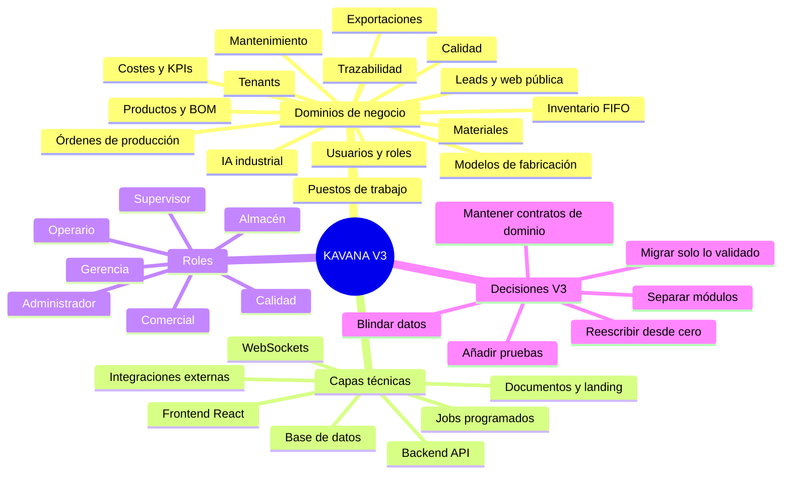
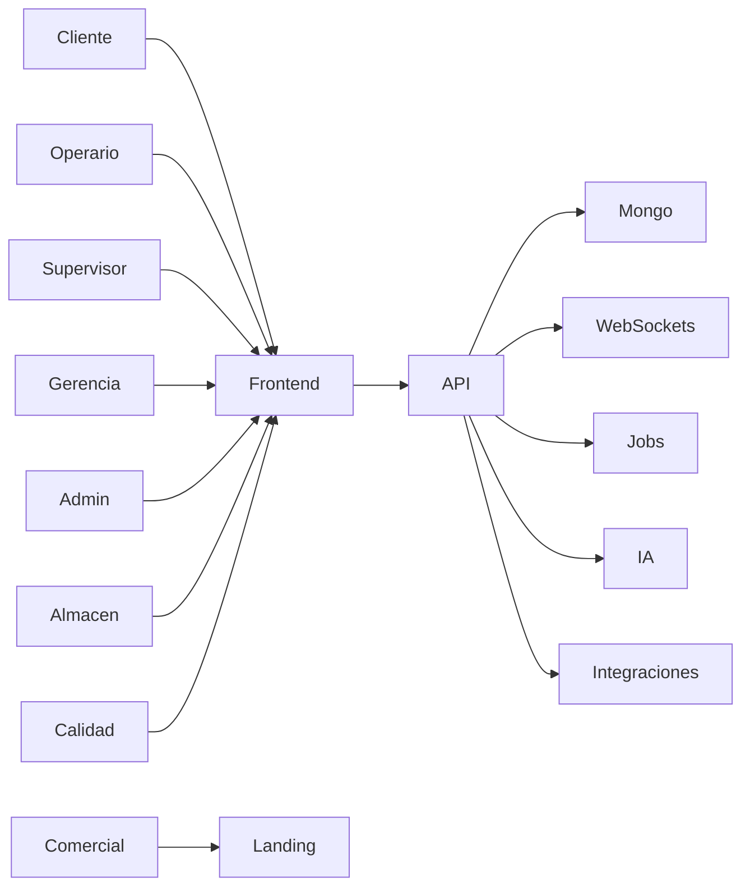

# Auditoría Técnica Senior y Mapa Mental KAVANA V3

> Carpeta origen auditada: `C:\Users\jorge\Desktop\proyectos IA\kavana systems v2`  
> Carpeta destino para el nuevo software: `C:\Users\jorge\Desktop\proyectos IA\kavana systems v2\KAVANA V3 JUNIO 2026`  
> Objetivo: separar lo que merece ser rescatado de la versión obsoleta, documentar la arquitectura y funcionalidades, y dejar una hoja de ruta para reescribir KAVANA V3 desde cero sin perder inteligencia de negocio.

---

## 1. Resumen ejecutivo para KAVANA V3

KAVANA Systems V2 es un **MES industrial MERN** con un núcleo de valor muy sólido: trazabilidad de producción, inventario FIFO por lotes, cálculo financiero en tiempo real, gestión de modelos de fabricación, panel táctil de operario, dashboards de supervisor/gerencia, IA contextual y documentación estratégica. También arrastra deuda técnica importante: backend monolítico en Express, lógica de producción demasiado grande, alta mezcla de UI legacy y V2, logs sensibles dispersos, scripts de mantenimiento en producción, dependencias cloud hardcodeadas y módulos que deben ser replanteados como dominios independientes.

La recomendación para V3 es **no copiar el proyecto tal cual**. V3 debe rescatar:

1. La **semántica de negocio** ya validada en V2.
2. Los **servicios críticos** de cálculo, inventario, trazabilidad y costes.
3. Los **componentes UX de planta** que ya resuelven problemas reales de operarios.
4. La **documentación estratégica y decisiones técnicas**.
5. Los **datos maestros/demo industrial** cuando aporten valor comercial.

Y debe reescribir:

1. La arquitectura backend hacia módulos de dominio.
2. El frontend hacia componentes reutilizables y una capa de estado más limpia.
3. La seguridad, logging, observabilidad y pruebas.
4. La migración de datos con contratos API explícitos.

---

## 2. Mapa mental de arquitectura y funcionalidades





---

## 3. Arquitectura actual de V2

### 3.1 Backend

El backend actual está construido con **Node.js, Express, Mongoose, JWT y Socket.io**. El punto de entrada principal es [`server.js`](kavana%20systems%20v2/backend/server.js:1), donde se montan middlewares, CORS, WebSocket, rutas y servicios en segundo plano.

Evidencias clave:

- Express y servidor HTTP están inicializados en [`server.js:9-10`](kavana%20systems%20v2/backend/server.js:9).
- Socket.io se configura globalmente para tiempo real en [`server.js:18-25`](kavana%20systems%20v2/backend/server.js:18).
- `global.io` se expone para servicios y controladores en [`server.js:27-33`](kavana%20systems%20v2/backend/server.js:27).
- La conexión MongoDB se realiza directamente en el entrypoint en [`server.js:54-57`](kavana%20systems%20v2/backend/server.js:54).
- Las rutas API se registran de forma plana en [`server.js:88-115`](kavana%20systems%20v2/backend/server.js:88).
- Servicios en segundo plano como auditoría, exportación programada y autómata se inician al arrancar en [`server.js:131-149`](kavana%20systems%20v2/backend/server.js:131).

**Lectura de auditoría:** para V3 conviene separar `server.js` en bootstrap, configuración, rutas, workers y observabilidad. El patrón actual es válido para MVP, pero insuficiente para una plataforma SaaS industrial escalable.

### 3.2 Frontend

El frontend usa **React 18, Vite, TailwindCSS, TanStack Query, Axios, Socket.io-client, Recharts, jsPDF y QR**. La estructura principal está en [`frontend/src/App.jsx`](kavana%20systems%20v2/frontend/src/App.jsx:1).

Evidencias clave:

- Contextos principales: autenticación, UI y configuración de operario en [`App.jsx:3-5`](kavana%20systems%20v2/frontend/src/App.jsx:3).
- Layouts separados para admin, gerencia y supervisor en [`App.jsx:17-21`](kavana%20systems%20v2/frontend/src/App.jsx:17).
- Rutas protegidas y por rol en [`App.jsx:78-110`](kavana%20systems%20v2/frontend/src/App.jsx:78).
- Rutas principales de admin, gerencia, supervisor, operario e inventario en [`App.jsx:123-210`](kavana%20systems%20v2/frontend/src/App.jsx:123).
- Dependencias principales en [`frontend/package.json:13-47`](kavana%20systems%20v2/frontend/package.json:13).

**Lectura de auditoría:** V3 debe conservar la filosofía UX industrial, pero no la duplicación de componentes legacy. Hay que convertir pantallas grandes en módulos reutilizables: producción, trazabilidad, inventario, calidad, mantenimiento y KPIs.

---

## 4. Modelo de dominio actual

### 4.1 Tenant

El tenant es la unidad multi-empresa del sistema. Está definido en [`Tenant.js`](kavana%20systems%20v2/backend/src/models/Tenant.js:1).

Campos de valor para V3:

- Identidad y estado: [`Tenant.js:3-8`](kavana%20systems%20v2/backend/src/models/Tenant.js:3).
- Método de login y configuración de línea: [`Tenant.js:9-12`](kavana%20systems%20v2/backend/src/models/Tenant.js:9).
- Exportación programada: [`Tenant.js:14-25`](kavana%20systems%20v2/backend/src/models/Tenant.js:14).
- Roles y permisos custom: [`Tenant.js:27-31`](kavana%20systems%20v2/backend/src/models/Tenant.js:27).
- Secuencias automáticas: [`Tenant.js:33-43`](kavana%20systems%20v2/backend/src/models/Tenant.js:33).
- Topología de puestos y grupos: [`Tenant.js:45-77`](kavana%20systems%20v2/backend/src/models/Tenant.js:45).
- Branding y tema: [`Tenant.js:79-91`](kavana%20systems%20v2/backend/src/models/Tenant.js:79).
- Costes globales: [`Tenant.js:93-109`](kavana%20systems%20v2/backend/src/models/Tenant.js:93).
- Planes y feature gating: [`Tenant.js:111-133`](kavana%20systems%20v2/backend/src/models/Tenant.js:111).

**Valor rescatable:** la estructura de tenant de V2 ya contiene una visión SaaS industrial muy completa. Para V3 debe convertirse en un dominio con límites claros: configuración, permisos, topología, costes, branding, planes y jobs.

### 4.2 Órdenes

La orden concentra cabecera, líneas embebidas, costes, RAL, campos custom y estado. Ver [`Order.js`](kavana%20systems%20v2/backend/src/models/Order.js:1).

Campos de valor:

- Línea de producción con secuencia, puesto, material, cantidades, estado, campos custom y costes en [`Order.js:3-56`](kavana%20systems%20v2/backend/src/models/Order.js:3).
- Cabecera con tenant, número, cliente, líneas, prioridad, estado, RAL, costes y borrado lógico en [`Order.js:58-87`](kavana%20systems%20v2/backend/src/models/Order.js:58).
- Índices por tenant, puesto, número y estado en [`Order.js:89-96`](kavana%20systems%20v2/backend/src/models/Order.js:89).
- Hook de cascada para limpiar registros huérfanos en [`Order.js:97-113`](kavana%20systems%20v2/backend/src/models/Order.js:97).

**Valor rescatable:** el concepto de orden como hilo conductor de producción, coste y trazabilidad es central. Para V3 conviene conservar la semántica, pero evaluar separar líneas, eventos, consumos y costes en entidades propias para evitar documentos demasiado grandes.

### 4.3 Modelos de fabricación

El modelo de fabricación representa piezas sueltas, rutas y especificaciones. Ver [`ManufacturingModel.js`](kavana%20systems%20v2/backend/src/models/ManufacturingModel.js:1).

Campos de valor:

- Identificación, puestos compatibles y material por defecto en [`ManufacturingModel.js:21-45`](kavana%20systems%20v2/backend/src/models/ManufacturingModel.js:21).
- Configuración de producción y unidad en [`ManufacturingModel.js:46-53`](kavana%20systems%20v2/backend/src/models/ManufacturingModel.js:46).
- Especificaciones técnicas, RAL, plano y campos custom en [`ManufacturingModel.js:55-67`](kavana%20systems%20v2/backend/src/models/ManufacturingModel.js:55).
- Longitudes predefinidas en [`ManufacturingModel.js:69-73`](kavana%20systems%20v2/backend/src/models/ManufacturingModel.js:69).
- Plan de calidad por modelo en [`ManufacturingModel.js:75-88`](kavana%20systems%20v2/backend/src/models/ManufacturingModel.js:75).
- Virtual `realUnitConsumptionMeters` con scrapGap en [`ManufacturingModel.js:102-110`](kavana%20systems%20v2/backend/src/models/ManufacturingModel.js:102).

**Valor rescatable:** este dominio es uno de los activos más importantes de V2. V3 debe conservar: modelo, puestos compatibles, material, velocidad, unidad, scrapGap, peso unitario, RAL, blueprint, calidad y longitudes predefinidas.

### 4.4 Inventario y lotes

El inventario FIFO está representado por [`StockItem.js`](kavana%20systems%20v2/backend/src/models/StockItem.js:1).

Campos de valor:

- Tenant, material, lote y coilId en [`StockItem.js:3-17`](kavana%20systems%20v2/backend/src/models/StockItem.js:3).
- Dimensiones físicas con validación industrial en [`StockItem.js:20-65`](kavana%20systems%20v2/backend/src/models/StockItem.js:20).
- Valoración FIFO, moneda y fecha de entrada en [`StockItem.js:67-75`](kavana%20systems%20v2/backend/src/models/StockItem.js:67).
- Ubicación, estado, retal/pico y creador en [`StockItem.js:76-85`](kavana%20systems%20v2/backend/src/models/StockItem.js:76).
- Índices para FIFO y lote en [`StockItem.js:89-96`](kavana%20systems%20v2/backend/src/models/StockItem.js:89).

**Valor rescatable:** el inventario por lote con dimensiones y valoración real es un diferencial industrial. V3 debe conservar la trazabilidad de lote, coste real, estado, ubicación, picos y validaciones físicas.

---

## 5. Funcionalidades que sí merecen ser rescatadas

### 5.1 Producción y órdenes

V2 contiene un motor de órdenes con:

- Creación por producto/BOM o pieza suelta.
- Cálculo de líneas por puesto.
- Cascada entre fases.
- RAL y especificaciones.
- Costes estimados y reales.
- Registro incremental de producción.
- Cierre de sesión y merma.
- Trazabilidad con logs.

Evidencia:

- [`OrderService.createOrder()`](kavana%20systems%20v2/backend/src/services/OrderService.js:53) procesa cabecera, productos, componentes y líneas.
- [`OrderService.calculateOrderLines()`](kavana%20systems%20v2/backend/src/services/OrderService.js:191) delega el cálculo financiero y de líneas.
- [`OrderService.recordProduction()`](kavana%20systems%20v2/backend/src/services/OrderService.js:553) es el núcleo de registro de producción.
- La validación de cascada está en [`OrderService.js:589-597`](kavana%20systems%20v2/backend/src/services/OrderService.js:589).
- El modo auditoría obliga a bobina escaneada en [`OrderService.js:578-583`](kavana%20systems%20v2/backend/src/services/OrderService.js:578).
- El consumo FIFO se invoca desde producción en [`OrderService.js:690-710`](kavana%20systems%20v2/backend/src/services/OrderService.js:690).
- Se registran consumos por lote en [`OrderService.js:712-730`](kavana%20systems%20v2/backend/src/services/OrderService.js:712).
- El desgaste de utillaje se incrementa en [`OrderService.js:759-771`](kavana%20systems%20v2/backend/src/services/OrderService.js:759).
- El coste laboral/máquina/overhead se acumula en [`OrderService.js:773-789`](kavana%20systems%20v2/backend/src/services/OrderService.js:773).

**Decisión V3:** rescatar el dominio completo, pero dividir el servicio en:

1. `OrderDomainService`
2. `ProductionRecordingService`
3. `MaterialConsumptionService`
4. `CostAccrualService`
5. `TraceabilityService`
6. `CascadeFlowService`
7. `ToolWearService`

### 5.2 Inventario FIFO y escaneo de bobinas

El inventario es uno de los activos más valiosos del proyecto.

Evidencia:

- [`InventoryService.addStock()`](kavana%20systems%20v2/backend/src/services/InventoryService.js:13) crea lote, transacción y actualiza agregados.
- [`InventoryService.consumeStockFIFO()`](kavana%20systems%20v2/backend/src/services/InventoryService.js:62) implementa consumo FIFO por material, puesto y prioridad.
- El modo auditoría restringe el consumo a bobinas vinculadas en [`InventoryService.js:77-119`](kavana%20systems%20v2/backend/src/services/InventoryService.js:77).
- El consumo parcial por lote se registra en [`InventoryService.js:155-215`](kavana%20systems%20v2/backend/src/services/InventoryService.js:155).
- [`InventoryService.consumeFromSpecificLot()`](kavana%20systems%20v2/backend/src/services/InventoryService.js:222) permite consumo directo de lote específico.

Frontend:

- [`MaterialScanner.jsx`](kavana%20systems%20v2/frontend/src/components/operator/MaterialScanner.jsx:1) es el componente de escaneo industrial.
- Carga lote por código y stock disponible en [`MaterialScanner.jsx:150-177`](kavana%20systems%20v2/frontend/src/components/operator/MaterialScanner.jsx:150).
- Filtra sugerencias FIFO por ancho y puesto en [`MaterialScanner.jsx:188-245`](kavana%20systems%20v2/frontend/src/components/operator/MaterialScanner.jsx:188).
- Vincula bobina automáticamente en [`MaterialScanner.jsx:291-326`](kavana%20systems%20v2/frontend/src/components/operator/MaterialScanner.jsx:291).
- Declara retal y merma en [`MaterialScanner.jsx:456-494`](kavana%20systems%20v2/frontend/src/components/operator/MaterialScanner.jsx:456).
- Muestra balance de material en [`MaterialScanner.jsx:935-1038`](kavana%20systems%20v2/frontend/src/components/operator/MaterialScanner.jsx:935).

**Decisión V3:** este componente debe rescatarse casi como dominio propio. Es una de las piezas más maduras de UX industrial.

### 5.3 Calculadora de fin de bobina y geometría inversa

El proyecto documenta la lógica de inversión geométrica en [`MODULO_MATERIALES.md`](kavana%20systems%20v2/_KAVANA_SYSTEMS_DOCS/MODULO_MATERIALES.md:1).

Evidencia:

- La utilidad de geometría inversa se menciona en [`MODULO_MATERIALES.md:62-69`](kavana%20systems%20v2/_KAVANA_SYSTEMS_DOCS/MODULO_MATERIALES.md:62).
- La decisión estratégica de inversión geométrica está en [`DECISIONES_ESTRATEGICAS.md:218-224`](kavana%20systems%20v2/_KAVANA_SYSTEMS_DOCS/DECISIONES_ESTRATEGICAS.md:218).
- El componente de calculadora está en [`CoilCalculator.jsx`](kavana%20systems%20v2/frontend/src/components/operator/CoilCalculator.jsx:1).
- Se integra desde el escáner en [`MaterialScanner.jsx:1198-1206`](kavana%20systems%20v2/frontend/src/components/operator/MaterialScanner.jsx:1198).

**Decisión V3:** convertir esta lógica en paquete/domain utility independiente: `coil-math`.

### 5.4 Modelos de fabricación y auto-especificaciones

V2 ya tiene un motor de modelos con parsing de dimensiones.

Evidencia:

- El modelo técnico en [`ManufacturingModel.js:55-67`](kavana%20systems%20v2/backend/src/models/ManufacturingModel.js:55).
- El virtual de consumo real en [`ManufacturingModel.js:102-110`](kavana%20systems%20v2/backend/src/models/ManufacturingModel.js:102).
- La documentación de auto-especificaciones está en [`LOGICA_CASCADA_Y_MODELOS.md:50-55`](kavana%20systems%20v2/_KAVANA_SYSTEMS_DOCS/LOGICA_CASCADA_Y_MODELOS.md:50).
- La decisión estratégica está en [`DECISIONES_ESTRATEGICAS.md:193-197`](kavana%20systems%20v2/_KAVANA_SYSTEMS_DOCS/DECISIONES_ESTRATEGICAS.md:193).

**Decisión V3:** mantener el concepto de modelo como plantilla industrial, pero añadir versionado de especificaciones y separar catálogo técnico de configuración de producción.

### 5.5 Trazabilidad ISO 9001

La trazabilidad es otro activo central.

Evidencia:

- La colección `ProductionLog` se documenta en [`LOGICA_CASCADA_Y_MODELOS.md:14-20`](kavana%20systems%20v2/_KAVANA_SYSTEMS_DOCS/LOGICA_CASCADA_Y_MODELOS.md:14).
- El registro de eventos se menciona en [`KAVANA_ULTRA_DOC.md:19-21`](kavana%20systems%20v2/_KAVANA_SYSTEMS_DOCS/KAVANA_ULTRA_DOC.md:19).
- La decisión estratégica de trazabilidad inmutable está en [`DECISIONES_ESTRATEGICAS.md:18-21`](kavana%20systems%20v2/_KAVANA_SYSTEMS_DOCS/DECISIONES_ESTRATEGICAS.md:18).
- El servicio `TraceabilityService` existe en [`backend/src/services/TraceabilityService.js`](kavana%20systems%20v2/backend/src/services/TraceabilityService.js:1).

**Decisión V3:** no permitir borrado manual de eventos de producción. Todo debe ser append-only con compensaciones explícitas.

### 5.6 Costes, KPIs y reportes

V2 integra costes de material, máquina, operario y overhead.

Evidencia:

- Los costes de tenant están en [`Tenant.js:93-109`](kavana%20systems%20v2/backend/src/models/Tenant.js:93).
- El cálculo de coste real está en [`OrderService.js:773-789`](kavana%20systems%20v2/backend/src/services/OrderService.js:773).
- El servicio `OrderCostCalculator` existe en [`backend/src/services/OrderCostCalculator.js`](kavana%20systems%20v2/backend/src/services/OrderCostCalculator.js:1).
- El servicio `KPIService` existe en [`backend/src/services/KPIService.js`](kavana%20systems%20v2/backend/src/services/KPIService.js:1).
- El servicio `OEEService` existe en [`backend/src/services/OEEService.js`](kavana%20systems%20v2/backend/src/services/OEEService.js:1).
- La ruta de costes está montada en [`server.js:109`](kavana%20systems%20v2/backend/server.js:109).

**Decisión V3:** separar contabilidad industrial de analítica operativa. Los KPIs deben calcularse desde eventos inmutables, no desde estados mutables.

### 5.7 Calidad y controles

V2 incluye módulo de calidad.

Evidencia:

- Modelo `QualityRecord` existe en [`backend/src/models/QualityRecord.js`](kavana%20systems%20v2/backend/src/models/QualityRecord.js:1).
- Servicio `QualityService` existe en [`backend/src/services/QualityService.js`](kavana%20systems%20v2/backend/src/services/QualityService.js:1).
- Ruta `/api/quality` montada en [`server.js:106`](kavana%20systems%20v2/backend/server.js:106).
- Modal de calidad en [`QualityCheckModal.jsx`](kavana%20systems%20v2/frontend/src/pages/operator/QualityCheckModal.jsx:1).
- Plan de calidad por modelo en [`ManufacturingModel.js:75-88`](kavana%20systems%20v2/backend/src/models/ManufacturingModel.js:75).

**Decisión V3:** mantener calidad como dominio obligatorio para clientes ISO. Añadir recordatorios, planes de inspección y evidencias con adjuntos.

### 5.8 Mantenimiento

V2 incluye mantenimiento preventivo basado en horas de uso.

Evidencia:

- Campos de mantenimiento en tenant/workstations en [`Tenant.js:52-57`](kavana%20systems%20v2/backend/src/models/Tenant.js:52) y [`Tenant.js:69-74`](kavana%20systems%20v2/backend/src/models/Tenant.js:69).
- Servicio `MaintenanceService` existe en [`backend/src/services/MaintenanceService.js`](kavana%20systems%20v2/backend/src/services/MaintenanceService.js:1).
- Ruta `/api/maintenance` montada en [`server.js:99`](kavana%20systems%20v2/backend/server.js:99).
- La decisión estratégica está en [`DECISIONES_ESTRATEGICAS.md:79-82`](kavana%20systems%20v2/_KAVANA_SYSTEMS_DOCS/DECISIONES_ESTRATEGICAS.md:79).

**Decisión V3:** conservar mantenimiento contextual, pero conectarlo a eventos de máquina y órdenes reales.

### 5.9 IA contextual

V2 tiene una capa de inteligencia industrial con fallback local/cloud.

Evidencia:

- Servicio `IntelligenceService` existe en [`backend/src/services/IntelligenceService.js`](kavana%20systems%20v2/backend/src/services/IntelligenceService.js:1).
- El servicio intenta detectar local/cloud en [`IntelligenceService.js:89-115`](kavana%20systems%20v2/backend/src/services/IntelligenceService.js:89).
- Genera snapshot de fábrica en [`IntelligenceService.js:169-170`](kavana%20systems%20v2/backend/src/services/IntelligenceService.js:169).
- La documentación del concepto está en [`KAVANA_INTELLIGENCE.md`](kavana%20systems%20v2/_KAVANA_SYSTEMS_DOCS/KAVANA_INTELLIGENCE.md:1).
- La arquitectura IA se describe en [`KAVANA_INTELLIGENCE.md:20-42`](kavana%20systems%20v2/_KAVANA_SYSTEMS_DOCS/KAVANA_INTELLIGENCE.md:20).
- El fallback local/cloud está descrito en [`KAVANA_INTELLIGENCE.md:72-76`](kavana%20systems%20v2/_KAVANA_SYSTEMS_DOCS/KAVANA_INTELLIGENCE.md:72).
- La decisión estratégica está en [`DECISIONES_ESTRATEGICAS.md:243-248`](kavana%20systems%20v2/_KAVANA_SYSTEMS_DOCS/DECISIONES_ESTRATEGICAS.md:243).

**Decisión V3:** mantener la IA como capa de análisis contextual, pero separarla del core MES. No debe ser dependiente de módulos monolíticos.

### 5.10 UX de operario y supervisor

V2 tiene una UX industrial específica, no genérica.

Evidencia:

- Filosofía `Un Vistazo, Un Click` en [`KAVANA_ULTRA_DOC.md:13-17`](kavana%20systems%20v2/_KAVANA_SYSTEMS_DOCS/KAVANA_ULTRA_DOC.md:13).
- Modo kiosco/tablet y zero-click login en [`KAVANA_ULTRA_DOC.md:19-23`](kavana%20systems%20v2/_KAVANA_SYSTEMS_DOCS/KAVANA_ULTRA_DOC.md:19).
- Dashboard Zen y navegación lateral en [`README.md:44-57`](kavana%20systems%20v2/_KAVANA_SYSTEMS_DOCS/README.md:44).
- Personalización de vista de operario en [`OperatorViewConfigContext.jsx`](kavana%20systems%20v2/frontend/src/contexts/OperatorViewConfigContext.jsx:1).
- Panel táctil V2 en [`OperatorDashboardV2.jsx`](kavana%20systems%20v2/frontend/src/pages/operator/OperatorDashboardV2.jsx:1).
- Modal de incidencias en [`IncidenciaModal.jsx`](kavana%20systems%20v2/frontend/src/pages/operator/IncidenciaModal.jsx:1).
- Dashboard de supervisor en [`SupervisorDashboard.jsx`](kavana%20systems%20v2/frontend/src/pages/SupervisorDashboard.jsx:1).

**Decisión V3:** conservar el diseño industrial: botones grandes, alto contraste, feedback visual, cero ruido, y navegación por rol.

---

## 6. Módulos actuales inventariados

### 6.1 Backend models

Lista de modelos recuperables:

| Modelo | Archivo | Valor para V3 |
|---|---|---|
| Tenant | [`Tenant.js`](kavana%20systems%20v2/backend/src/models/Tenant.js:1) | Multi-tenant, roles, puestos, costes, planes |
| User | [`User.js`](kavana%20systems%20v2/backend/src/models/User.js:1) | Usuarios, roles, sesión, operarios |
| Order | [`Order.js`](kavana%20systems%20v2/backend/src/models/Order.js:1) | Órdenes, líneas, costes, RAL |
| ManufacturingModel | [`ManufacturingModel.js`](kavana%20systems%20v2/backend/src/models/ManufacturingModel.js:1) | Modelos de fabricación y calidad |
| Material | [`Material.js`](kavana%20systems%20v2/backend/src/models/Material.js:1) | Materiales, coste estándar, stock |
| StockItem | [`StockItem.js`](kavana%20systems%20v2/backend/src/models/StockItem.js:1) | Lotes FIFO, bobinas, picos |
| MaterialTransaction | [`MaterialTransaction.js`](kavana%20systems%20v2/backend/src/models/MaterialTransaction.js:1) | Kardex de movimientos |
| MaterialConsumo | [`MaterialConsumo.js`](kavana%20systems%20v2/backend/src/models/MaterialConsumo.js:1) | Consumo real por orden |
| ProductionLog | [`ProductionLog.js`](kavana%20systems%20v2/backend/src/models/ProductionLog.js:1) | Trazabilidad inmutable |
| QualityRecord | [`QualityRecord.js`](kavana%20systems%20v2/backend/src/models/QualityRecord.js:1) | Controles de calidad |
| Tooling | [`Tooling.js`](kavana%20systems%20v2/backend/src/models/Tooling.js:1) | Utillaje y desgaste |
| Incidencia | [`Incidencia.js`](kavana%20systems%20v2/backend/src/models/Incidencia.js:1) | Incidencias de planta |
| Lead | [`Lead.js`](kavana%20systems%20v2/backend/src/models/Lead.js:1) | Captura comercial |
| RevokedToken | [`RevokedToken.js`](kavana%20systems%20v2/backend/src/models/RevokedToken.js:1) | Invalidación JWT |
| SavedView | [`SavedView.js`](kavana%20systems%20v2/backend/src/models/SavedView.js:1) | Vistas dinámicas |
| CustomFieldDefinition | [`CustomFieldDefinition.js`](kavana%20systems%20v2/backend/src/models/CustomFieldDefinition.js:1) | Formularios dinámicos |
| CalculatorPreset | [`CalculatorPreset.js`](kavana%20systems%20v2/backend/src/models/CalculatorPreset.js:1) | Calculadora de operario |
| Sequence | [`Sequence.js`](kavana%20systems%20v2/backend/src/models/Sequence.js:1) | Numeración automática |
| Export/ImportLog | [`Export.js`](kavana%20systems%20v2/backend/src/models/Export.js:1), [`ImportLog.js`](kavana%20systems%20v2/backend/src/models/ImportLog.js:1) | Migración y data vault |

### 6.2 Backend services

Lista de servicios recuperables:

| Servicio | Archivo | Valor para V3 |
|---|---|---|
| AuthService | [`AuthService.js`](kavana%20systems%20v2/backend/src/services/AuthService.js:1) | Login, sesiones, turnos |
| OrderService | [`OrderService.js`](kavana%20systems%20v2/backend/src/services/OrderService.js:1) | Núcleo de órdenes y producción |
| OrderCostCalculator | [`OrderCostCalculator.js`](kavana%20systems%20v2/backend/src/services/OrderCostCalculator.js:1) | Cálculo financiero |
| InventoryService | [`InventoryService.js`](kavana%20systems%20v2/backend/src/services/InventoryService.js:1) | FIFO y stock |
| TraceabilityService | [`TraceabilityService.js`](kavana%20systems%20v2/backend/src/services/TraceabilityService.js:1) | Logs productivos |
| KPIService | [`KPIService.js`](kavana%20systems%20v2/backend/src/services/KPIService.js:1) | KPIs |
| OEEService | [`OEEService.js`](kavana%20systems%20v2/backend/src/services/OEEService.js:1) | OEE |
| QualityService | [`QualityService.js`](kavana%20systems%20v2/backend/src/services/QualityService.js:1) | Calidad |
| MaintenanceService | [`MaintenanceService.js`](kavana%20systems%20v2/backend/src/services/MaintenanceService.js:1) | Mantenimiento |
| IntelligenceService | [`IntelligenceService.js`](kavana%20systems%20v2/backend/src/services/IntelligenceService.js:1) | IA contextual |
| ExportService | [`ExportService.js`](kavana%20systems%20v2/backend/src/services/ExportService.js:1) | Excel/PDF |
| ImportService | [`ImportService.js`](kavana%20systems%20v2/backend/src/services/ImportService.js:1) | Importación masiva |
| ScheduledExportService | [`ScheduledExportService.js`](kavana%20systems%20v2/backend/src/services/ScheduledExportService.js:1) | Data vault |
| AutomatonService | [`AutomatonService.js`](kavana%20systems%20v2/backend/src/services/AutomatonService.js:1) | Alertas automáticas |
| AuditLoggerService | [`AuditLoggerService.js`](kavana%20systems%20v2/backend/src/services/AuditLoggerService.js:1) | Auditoría y Telegram |
| StockAlertService | [`StockAlertService.js`](kavana%20systems%20v2/backend/src/services/StockAlertService.js:1) | Alertas de stock |
| ValidationService | [`ValidationService.js`](kavana%20systems%20v2/backend/src/services/ValidationService.js:1) | Validaciones dinámicas |
| CalculationEngine | [`CalculationEngine.js`](kavana%20systems%20v2/backend/src/services/CalculationEngine.js:1) | Fórmulas |
| SequenceService | [`SequenceService.js`](kavana%20systems%20v2/backend/src/services/SequenceService.js:1) | Secuencias |
| TenantService | [`TenantService.js`](kavana%20systems%20v2/backend/src/services/TenantService.js:1) | Tenant |

### 6.3 Frontend páginas

Lista de páginas recuperables:

| Área | Archivos | Valor para V3 |
|---|---|---|
| Admin | [`pages/admin`](kavana%20systems%20v2/frontend/src/pages/admin) | Gestión completa |
| Gerencia | [`pages/gerencia`](kavana%20systems%20v2/frontend/src/pages/gerencia) | KPIs y costes |
| Supervisor | [`pages/supervisor`](kavana%20systems%20v2/frontend/src/pages/supervisor) | Control de planta |
| Operario | [`pages/operator`](kavana%20systems%20v2/frontend/src/pages/operator) | Panel táctil |
| Inventario | [`pages/inventory`](kavana%20systems%20v2/frontend/src/pages/inventory) | Recepción FIFO |
| Pública | [`pages/public`](kavana%20systems%20v2/frontend/src/pages/public) | Landing, portafolio, subida móvil |

### 6.4 Frontend API clients

Lista de clientes API recuperables:

| Cliente | Archivo | Valor para V3 |
|---|---|---|
| Auth | [`api/auth.js`](kavana%20systems%20v2/frontend/src/api/auth.js:1) | Login/logout |
| Axios | [`api/axios.js`](kavana%20systems%20v2/frontend/src/api/axios.js:1) | Cliente central con token |
| Production | [`api/production.js`](kavana%20systems%20v2/frontend/src/api/production.js:1) | Órdenes |
| Inventory | [`api/inventory.js`](kavana%20systems%20v2/frontend/src/api/inventory.js:1) | Stock |
| Materials | [`api/materials.js`](kavana%20systems%20v2/frontend/src/api/materials.js:1) | Materiales |
| KPIs | [`api/kpis.js`](kavana%20systems%20v2/frontend/src/api/kpis.js:1) | KPIs |
| Quality | [`api/quality.js`](kavana%20systems%20v2/frontend/src/api/quality.js:1) | Calidad |
| Maintenance | [`api/maintenance.js`](kavana%20systems%20v2/frontend/src/api/maintenance.js:1) | Mantenimiento |
| Views | [`api/views.js`](kavana%20systems%20v2/frontend/src/api/views.js:1) | Vistas dinámicas |

---

## 7. Flujos críticos de negocio

### 7.1 Creación de orden

```mermaid
flowchart TD
  Usuario crea orden
  Validacion campos
  Seleccion modelo
  Calculo lineas
  Calculo coste estimado
  Persiste orden
  Genera logs iniciales
  Orden visible en supervisor
  Operario inicia turno
```

Evidencia:

- La creación de órdenes se inicia en [`OrderService.createOrder()`](kavana%20systems%20v2/backend/src/services/OrderService.js:53).
- El cálculo de líneas se delega en [`OrderService.js:191-195`](kavana%20systems%20v2/backend/src/services/OrderService.js:191).
- El producto/BOM se expande en [`OrderService.js:80-172`](kavana%20systems%20v2/backend/src/services/OrderService.js:80).
- La persistencia final está en [`OrderService.js:197-205`](kavana%20systems%20v2/backend/src/services/OrderService.js:197).

### 7.2 Registro de producción

```mermaid
flowchart TD
  Operario registra cantidad
  Validar rol
  Validar cascada
  Resolver modelo
  Resolver material
  Calcular consumo
  Consumir FIFO
  Registrar MaterialConsumo
  Registrar ProductionLog
  Actualizar costes
  Emitir WebSocket
```

Evidencia:

- El núcleo está en [`OrderService.recordProduction()`](kavana%20systems%20v2/backend/src/services/OrderService.js:553).
- La validación de rol está en [`OrderService.js:563-566`](kavana%20systems%20v2/backend/src/services/OrderService.js:563).
- La cascada se valida en [`OrderService.js:589-597`](kavana%20systems%20v2/backend/src/services/OrderService.js:589).
- El consumo FIFO se invoca en [`OrderService.js:690-710`](kavana%20systems%20v2/backend/src/services/OrderService.js:690).
- El consumo se registra en [`OrderService.js:712-730`](kavana%20systems%20v2/backend/src/services/OrderService.js:712).
- El desgaste de herramienta se actualiza en [`OrderService.js:759-771`](kavana%20systems%20v2/backend/src/services/OrderService.js:759).
- El coste laboral se calcula en [`OrderService.js:773-789`](kavana%20systems%20v2/backend/src/services/OrderService.js:773).

### 7.3 Inventario FIFO

```mermaid
flowchart TD
  Recepción material
  Crear lote
  Calcular coste real
  Registrar kardex
  Actualizar stock material
  Operario escanea bobina
  Vincular lote a orden
  Registrar producción
  Consumir FIFO
  Generar MaterialConsumo
```

Evidencia:

- La recepción crea lote en [`InventoryService.addStock()`](kavana%20systems%20v2/backend/src/services/InventoryService.js:13).
- El consumo FIFO está en [`InventoryService.consumeStockFIFO()`](kavana%20systems%20v2/backend/src/services/InventoryService.js:62).
- El modo auditoría filtra bobinas vinculadas en [`InventoryService.js:77-119`](kavana%20systems%20v2/backend/src/services/InventoryService.js:77).
- El frontend escanea y vincula en [`MaterialScanner.jsx:291-326`](kavana%20systems%20v2/frontend/src/components/operator/MaterialScanner.jsx:291).

### 7.4 Trazabilidad

```mermaid
flowchart TD
  Inicio orden
  Inicio sesión
  Registro producción
  Pausa
  Reanudación
  Scrap
  Finalización
  Eventos inmutables
```

Evidencia:

- La colección se documenta en [`LOGICA_CASCADA_Y_MODELOS.md:14-20`](kavana%20systems%20v2/_KAVANA_SYSTEMS_DOCS/LOGICA_CASCADA_Y_MODELOS.md:14).
- La decisión estratégica está en [`DECISIONES_ESTRATEGICAS.md:18-21`](kavana%20systems%20v2/_KAVANA_SYSTEMS_DOCS/DECISIONES_ESTRATEGICAS.md:18).
- El servicio existe en [`TraceabilityService.js`](kavana%20systems%20v2/backend/src/services/TraceabilityService.js:1).

---

## 8. Deuda técnica y riesgos

### 8.1 Riesgos críticos

| Riesgo | Evidencia | Impacto | Recomendación V3 |
|---|---|---|---|
| Backend monolítico | Rutas planas en [`server.js:88-115`](kavana%20systems%20v2/backend/server.js:88) | Difícil escalar | Modularizar por dominio |
| Servicio de producción demasiado grande | [`OrderService.recordProduction()`](kavana%20systems%20v2/backend/src/services/OrderService.js:553) | Complejo de mantener | Separar responsabilidades |
| Logs sensibles dispersos | Búsquedas muestran muchos `console.log` en backend y frontend | Fuga de información | Logging estructurado |
| UI legacy mezclada con V2 | [`OperatorDashboard.jsx`](kavana%20systems%20v2/frontend/src/pages/operator/OperatorDashboard.jsx:1) y [`OperatorDashboardV2.jsx`](kavana%20systems%20v2/frontend/src/pages/operator/OperatorDashboardV2.jsx:1) | Duplicidad | Reescribir con componentes base |
| API hardcodeada | Fallback en [`axios.js:4-8`](kavana%20systems%20v2/frontend/src/api/axios.js:4) | Fragilidad cloud | Configurar por entorno |
| Datos maestros en scripts | Carpeta `scripts` con semillas y reparaciones | Riesgo de ejecución accidental | Convertir en migraciones versionadas |
| Modelo de órdenes muy cargado | [`Order.js`](kavana%20systems%20v2/backend/src/models/Order.js:1) | Límite de documento | Evaluar separación de líneas/eventos |
| Seguridad incompleta | Hay RBAC en producción pero no uniforme en todos los módulos | Riesgo de acceso indebido | Policy centralizada |

### 8.2 Hallazgos concretos

1. **Logging excesivo**  
   La búsqueda global encontró 255 resultados en backend con `console.log`, `TODO`, `debug` o `legacy`. Esto no implica que todo sea malo, pero sí que V3 necesita logging estructurado.

2. **Frontend legacy**  
   Existen dos paneles de operario: [`OperatorDashboard.jsx`](kavana%20systems%20v2/frontend/src/pages/operator/OperatorDashboard.jsx:1) y [`OperatorDashboardV2.jsx`](kavana%20systems%20v2/frontend/src/pages/operator/OperatorDashboardV2.jsx:1). V3 debe evitar esa duplicidad.

3. **Modelos con campos legacy**  
   El propio código conserva campos como `largo`, `peso`, `materialAsociado` y rutas legacy. V3 debe tener contrato de datos limpio y migración explícita.

4. **Scripts de diagnóstico mezclados con código productivo**  
   La carpeta [`backend/src/scripts`](kavana%20systems%20v2/backend/src/scripts) contiene scripts útiles, pero no deben convivir con código de producción sin control.

5. **Seguridad parcialmente endurecida**  
   [`authMiddleware.js`](kavana%20systems%20v2/backend/src/middlewares/authMiddleware.js:1) verifica JWT y tokens revocados. [`production.js`](kavana%20systems%20v2/backend/src/routes/production.js:8) usa RBAC. Pero V3 debe aplicar políticas de autorización centralizadas.

6. **Cliente Axios resiliente pero con console.warn**  
   [`axios.js`](kavana%20systems%20v2/frontend/src/api/axios.js:1) maneja red y 401, pero aún imprime advertencias. V3 debe usar logger frontend controlado.

---

## 9. Qué rescatar, qué reescribir y qué descartar

### 9.1 Rescatar casi intacto

- Topología de fábrica y grupos de puestos documentada en [`TOPOLOGIA_FABRICA.md`](kavana%20systems%20v2/_KAVANA_SYSTEMS_DOCS/TOPOLOGIA_FABRICA.md:1).
- Modelo de tenant multi-empresa en [`Tenant.js`](kavana%20systems%20v2/backend/src/models/Tenant.js:1).
- Modelo de fabricación en [`ManufacturingModel.js`](kavana%20systems%20v2/backend/src/models/ManufacturingModel.js:1).
- Inventario FIFO en [`InventoryService.js`](kavana%20systems%20v2/backend/src/services/InventoryService.js:1).
- Escáner de bobinas en [`MaterialScanner.jsx`](kavana%20systems%20v2/frontend/src/components/operator/MaterialScanner.jsx:1).
- Calculadora de fin de bobina en [`CoilCalculator.jsx`](kavana%20systems%20v2/frontend/src/components/operator/CoilCalculator.jsx:1).
- Trazabilidad inmutable documentada en [`LOGICA_CASCADA_Y_MODELOS.md:14-20`](kavana%20systems%20v2/_KAVANA_SYSTEMS_DOCS/LOGICA_CASCADA_Y_MODELOS.md:14).
- Costes en tiempo real documentados en [`LOGICA_CASCADA_Y_MODELOS.md:21-25`](kavana%20systems%20v2/_KAVANA_SYSTEMS_DOCS/LOGICA_CASCADA_Y_MODELOS.md:21).
- IA contextual documentada en [`KAVANA_INTELLIGENCE.md`](kavana%20systems%20v2/_KAVANA_SYSTEMS_DOCS/KAVANA_INTELLIGENCE.md:1).
- Decisiones estratégicas en [`DECISIONES_ESTRATEGICAS.md`](kavana%20systems%20v2/_KAVANA_SYSTEMS_DOCS/DECISIONES_ESTRATEGICAS.md:1).

### 9.2 Rescatar con refactor

- `OrderService` porque contiene reglas de negocio valiosas pero demasiado mezcladas.
- `OEEService` porque contiene lógica de KPIs valiosa pero requiere pruebas de calibración.
- `MaterialScanner` porque es muy valioso, pero debe separarse de lógica de negocio directa.
- `SupervisorDashboard` porque contiene datos/mock y lógica visual que debe limpiarse.
- `ThemeEditor` porque la idea de branding es buena, pero la persistencia debe ser segura.
- `DataImportWizard` porque es útil, pero debe tener validaciones y dry-run.

### 9.3 Descartar o reescribir

- Copiar la carpeta entera tal cual.
- Scripts de reparación sin convertirlos en migraciones.
- Logs de debug y console en producción.
- Componentes legacy duplicados.
- Rutas API sin tests.
- Endpoints sin contratos TypeScript/Zod.
- Hardcoding de URLs cloud.
- UI con estilos inline excesivos y sin tokens.

---

## 10. Arquitectura recomendada para KAVANA V3

### 10.1 Principios

1. **Dominios primero:** cada módulo debe tener responsabilidades claras.
2. **Eventos inmutables:** producción, consumo, calidad, mantenimiento e incidencias deben ser append-only.
3. **Contratos API explícitos:** usar validación de entrada y salida.
4. **Multi-tenant nativo:** cada tenant debe estar aislado por defecto.
5. **Offline-first real:** el operario debe poder seguir trabajando aunque caiga la red.
6. **Observabilidad estructurada:** nada de `console.log` suelto.
7. **Migraciones versionadas:** los scripts actuales deben convertirse en migraciones y seeds controlados.
8. **UI industrial:** mantener la identidad visual KAVANA, no rediseñar hacia genérico.

### 10.2 Propuesta modular

```mermaid
flowchart LR
  API Gateway --> Auth
  API Gateway --> Tenant
  API Gateway --> Catalog
  API Gateway --> Production
  API Gateway --> Inventory
  API Gateway --> Quality
  API Gateway --> Maintenance
  API Gateway --> Analytics
  API Gateway --> Intelligence
  Auth --> Users
  Catalog --> Models
  Catalog --> Materials
  Production --> Orders
  Production --> Logs
  Inventory --> Stock
  Inventory --> Transactions
  Quality --> Inspections
  Maintenance --> WorkOrders
  Analytics --> KPIs
  Intelligence --> Reports
```

### 10.3 Servicios sugeridos para V3

| Servicio | Origen V2 | Comentario |
|---|---|---|
| `tenant-service` | [`TenantService.js`](kavana%20systems%20v2/backend/src/services/TenantService.js:1) | Config, planes, branding |
| `auth-service` | [`AuthService.js`](kavana%20systems%20v2/backend/src/services/AuthService.js:1) | Login, sesiones, tokens |
| `catalog-service` | [`ManufacturingModel.js`](kavana%20systems%20v2/backend/src/models/ManufacturingModel.js:1) | Modelos, productos, BOM |
| `order-service` | [`OrderService.js`](kavana%20systems%20v2/backend/src/services/OrderService.js:1) | Órdenes y líneas |
| `production-service` | [`OrderService.recordProduction()`](kavana%20systems%20v2/backend/src/services/OrderService.js:553) | Registro incremental |
| `inventory-service` | [`InventoryService.js`](kavana%20systems%20v2/backend/src/services/InventoryService.js:1) | FIFO y stock |
| `traceability-service` | [`TraceabilityService.js`](kavana%20systems%20v2/backend/src/services/TraceabilityService.js:1) | Logs inmutables |
| `cost-service` | [`OrderCostCalculator.js`](kavana%20systems%20v2/backend/src/services/OrderCostCalculator.js:1) | Costes y márgenes |
| `quality-service` | [`QualityService.js`](kavana%20systems%20v2/backend/src/services/QualityService.js:1) | Inspecciones |
| `maintenance-service` | [`MaintenanceService.js`](kavana%20systems%20v2/backend/src/services/MaintenanceService.js:1) | Preventivo |
| `analytics-service` | [`KPIService.js`](kavana%20systems%20v2/backend/src/services/KPIService.js:1), [`OEEService.js`](kavana%20systems%20v2/backend/src/services/OEEService.js:1) | KPIs y OEE |
| `intelligence-service` | [`IntelligenceService.js`](kavana%20systems%20v2/backend/src/services/IntelligenceService.js:1) | IA contextual |
| `export-service` | [`ExportService.js`](kavana%20systems%20v2/backend/src/services/ExportService.js:1) | Excel/PDF |
| `import-service` | [`ImportService.js`](kavana%20systems%20v2/backend/src/services/ImportService.js:1) | Carga masiva |
| `notification-service` | [`AuditLoggerService.js`](kavana%20systems%20v2/backend/src/services/AuditLoggerService.js:1) | Telegram/email/webhooks |

### 10.4 Frontend sugerido para V3

| Área | Componentes a rescatar |
|---|---|
| Operario | [`MaterialScanner.jsx`](kavana%20systems%20v2/frontend/src/components/operator/MaterialScanner.jsx:1), [`CoilCalculator.jsx`](kavana%20systems%20v2/frontend/src/components/operator/CoilCalculator.jsx:1), [`CalculatorModal.jsx`](kavana%20systems%20v2/frontend/src/components/operator/CalculatorModal.jsx:1), [`BlueprintViewer.jsx`](kavana%20systems%20v2/frontend/src/components/operator/BlueprintViewer.jsx:1) |
| Supervisor | [`SupervisorDashboard.jsx`](kavana%20systems%20v2/frontend/src/pages/SupervisorDashboard.jsx:1), [`AndonBoard.jsx`](kavana%20systems%20v2/frontend/src/components/supervisor/AndonBoard.jsx:1), [`SupervisorStock.jsx`](kavana%20systems%20v2/frontend/src/pages/supervisor/SupervisorStock.jsx:1), [`SupervisorMaintenance.jsx`](kavana%20systems%20v2/frontend/src/pages/supervisor/SupervisorMaintenance.jsx:1) |
| Admin | [`MaterialManager.jsx`](kavana%20systems%20v2/frontend/src/pages/admin/MaterialManager.jsx:1), [`ManufacturingModelManager.jsx`](kavana%20systems%20v2/frontend/src/pages/admin/ManufacturingModelManager.jsx:1), [`WorkstationManager.jsx`](kavana%20systems%20v2/frontend/src/pages/admin/WorkstationManager.jsx:1), [`ToolingManager.jsx`](kavana%20systems%20v2/frontend/src/pages/admin/ToolingManager.jsx:1) |
| Gerencia | [`ManagementDashboard.jsx`](kavana%20systems%20v2/frontend/src/pages/gerencia/ManagementDashboard.jsx:1), [`KPIs.jsx`](kavana%20systems%20v2/frontend/src/pages/gerencia/KPIs.jsx:1), [`CostCenter.jsx`](kavana%20systems%20v2/frontend/src/pages/admin/CostCenter.jsx:1) |
| IA | [`IntelligenceDashboard.jsx`](kavana%20systems%20v2/frontend/src/pages/admin/IntelligenceDashboard.jsx:1), [`SupervisorAssistant.jsx`](kavana%20systems%20v2/frontend/src/pages/supervisor/SupervisorAssistant.jsx:1) |

---

## 11. Plan de recuperación para V3

### Fase 1: Inventario y extracción

1. Copiar documentación estratégica a V3.
2. Extraer modelos de datos críticos.
3. Extraer servicios de cálculo y validación.
4. Extraer componentes de planta.
5. Identificar scripts útiles y convertirlos en migraciones.

### Fase 2: Reescritura del core

1. Crear dominio de tenant.
2. Crear dominio de catálogo.
3. Crear dominio de órdenes.
4. Crear dominio de producción.
5. Crear dominio de inventario.
6. Crear dominio de trazabilidad.

### Fase 3: Reescritura de UX

1. Crear sistema de diseño industrial.
2. Reescribir panel de operario.
3. Reescribir panel de supervisor.
4. Reescribir panel de gerencia.
5. Reescribir administración.

### Fase 4: Calidad, mantenimiento e IA

1. Integrar calidad como dominio obligatorio.
2. Integrar mantenimiento contextual.
3. Integrar IA contextual.
4. Integrar exportaciones y reportes.

### Fase 5: Hardening

1. Tests unitarios.
2. Tests de integración.
3. Tests E2E.
4. Auditoría de seguridad.
5. Observabilidad.
6. Migración de datos.

---

## 12. Mapa de decisiones estratégicas heredadas

| Decisión | Archivo | Valor para V3 |
|---|---|---|
| Offline-first | [`DECISIONES_ESTRATEGICAS.md:13-16`](kavana%20systems%20v2/_KAVANA_SYSTEMS_DOCS/DECISIONES_ESTRATEGICAS.md:13) | Mantener |
| Trazabilidad ISO | [`DECISIONES_ESTRATEGICAS.md:18-21`](kavana%20systems%20v2/_KAVANA_SYSTEMS_DOCS/DECISIONES_ESTRATEGICAS.md:18) | Mantener |
| Costes en tiempo real | [`DECISIONES_ESTRATEGICAS.md:22-25`](kavana%20systems%20v2/_KAVANA_SYSTEMS_DOCS/DECISIONES_ESTRATEGICAS.md:22) | Mantener |
| Feature gating | [`DECISIONES_ESTRATEGICAS.md:27-30`](kavana%20systems%20v2/_KAVANA_SYSTEMS_DOCS/DECISIONES_ESTRATEGICAS.md:27) | Mantener |
| Zero-click login | [`DECISIONES_ESTRATEGICAS.md:32-35`](kavana%20systems%20v2/_KAVANA_SYSTEMS_DOCS/DECISIONES_ESTRATEGICAS.md:32) | Mantener |
| Inventario simple vs FIFO | [`DECISIONES_ESTRATEGICAS.md:37-40`](kavana%20systems%20v2/_KAVANA_SYSTEMS_DOCS/DECISIONES_ESTRATEGICAS.md:37) | Mantener |
| Dynamic forms | [`DECISIONES_ESTRATEGICAS.md:69-72`](kavana%20systems%20v2/_KAVANA_SYSTEMS_DOCS/DECISIONES_ESTRATEGICAS.md:69) | Mantener |
| RAL nativo | [`DECISIONES_ESTRATEGICAS.md:89-93`](kavana%20systems%20v2/_KAVANA_SYSTEMS_DOCS/DECISIONES_ESTRATEGICAS.md:89) | Mantener |
| Fin de bobina | [`DECISIONES_ESTRATEGICAS.md:218-224`](kavana%20systems%20v2/_KAVANA_SYSTEMS_DOCS/DECISIONES_ESTRATEGICAS.md:218) | Mantener |
| IA híbrida | [`DECISIONES_ESTRATEGICAS.md:243-248`](kavana%20systems%20v2/_KAVANA_SYSTEMS_DOCS/DECISIONES_ESTRATEGICAS.md:243) | Mantener |
| Diseño industrial | [`DECISIONES_ESTRATEGICAS.md:258-263`](kavana%20systems%20v2/_KAVANA_SYSTEMS_DOCS/DECISIONES_ESTRATEGICAS.md:258) | Mantener |
| OEE T-Line | [`DECISIONES_ESTRATEGICAS.md:279-286`](kavana%20systems%20v2/_KAVANA_SYSTEMS_DOCS/DECISIONES_ESTRATEGICAS.md:279) | Mantener |
| Security hardening | [`DECISIONES_ESTRATEGICAS.md:302-311`](kavana%20systems%20v2/_KAVANA_SYSTEMS_DOCS/DECISIONES_ESTRATEGICAS.md:302) | Mantener y ampliar |

---

## 13. Riesgos de migración

| Riesgo | Mitigación |
|---|---|
| Perder lógica de negocio al reescribir | Extraer primero reglas a especificaciones y tests |
| Migrar deuda técnica | No copiar componentes legacy sin refactor |
| Romper UX de operario | Mantener prototipos visuales de V2 como referencia |
| Perder trazabilidad | Diseñar eventos append-only desde el inicio |
| Errores de coste | Reimplementar `OrderCostCalculator` con pruebas |
| Inventario inconsistente | Crear migración de stock y reconciliación |
| IA sin contexto | Mantener snapshot de fábrica como contrato |
| Despliegue frágil | Separar configuración por entorno |

---

## 14. Conclusión de auditoría

KAVANA Systems V2 no debe tratarse como código muerto. Es una base de conocimiento industrial muy valiosa. Su mayor activo no es la estructura actual, sino la **inteligencia de negocio acumulada**: trazabilidad, costes, inventario FIFO, modelos de fabricación, UX de planta, IA contextual y decisiones estratégicas.

La mejor estrategia para V3 es:

1. **Reescribir la arquitectura.**
2. **Rescatar los dominios.**
3. **Conservar la UX industrial.**
4. **Blindar la trazabilidad.**
5. **Separar IA, analytics y core MES.**
6. **Convertir scripts en migraciones.**
7. **Documentar cada regla de negocio antes de implementarla.**

Este documento debe servir como mapa base para construir el nuevo proyecto en la carpeta `KAVANA V3 JUNIO 2026`.

---

## 15. Índice de referencia rápida

| Tema | Referencia |
|---|---|
| README técnico | [`README.md`](kavana%20systems%20v2/_KAVANA_SYSTEMS_DOCS/README.md:1) |
| Ultra doc | [`KAVANA_ULTRA_DOC.md`](kavana%20systems%20v2/_KAVANA_SYSTEMS_DOCS/KAVANA_ULTRA_DOC.md:1) |
| Decisiones estratégicas | [`DECISIONES_ESTRATEGICAS.md`](kavana%20systems%20v2/_KAVANA_SYSTEMS_DOCS/DECISIONES_ESTRATEGICAS.md:1) |
| Historial de auditorías | [`HISTORIAL_AUDITORIAS.md`](kavana%20systems%20v2/_KAVANA_SYSTEMS_DOCS/HISTORIAL_AUDITORIAS.md:1) |
| Topología de fábrica | [`TOPOLOGIA_FABRICA.md`](kavana%20systems%20v2/_KAVANA_SYSTEMS_DOCS/TOPOLOGIA_FABRICA.md:1) |
| Lógica de cascada | [`LOGICA_CASCADA_Y_MODELOS.md`](kavana%20systems%20v2/_KAVANA_SYSTEMS_DOCS/LOGICA_CASCADA_Y_MODELOS.md:1) |
| Módulo materiales | [`MODULO_MATERIALES.md`](kavana%20systems%20v2/_KAVANA_SYSTEMS_DOCS/MODULO_MATERIALES.md:1) |
| Inteligencia | [`KAVANA_INTELLIGENCE.md`](kavana%20systems%20v2/_KAVANA_SYSTEMS_DOCS/KAVANA_INTELLIGENCE.md:1) |
