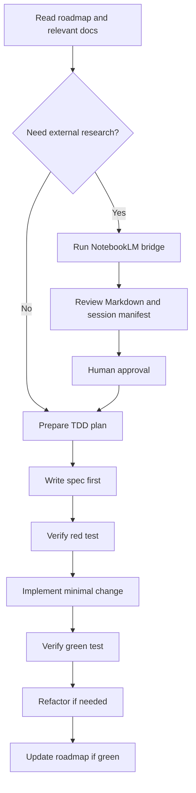

# AI Orchestration Architecture

> Universal operating manual for AI-assisted development with TDD and optional NotebookLM context.

## Document status

- **Status:** Template.
- **Last updated:** TBD.
- **Scope:** Project-agnostic AI orchestration workflow.

## Purpose

This document explains how an AI assistant should work with the project without relying on conversational memory as the source of truth.

The goal is to combine:

- local project context,
- optional AI research,
- human approval,
- test-driven development,
- concise documentation updates.

## Core workflow

## Context-first rule

Before proposing or implementing a change, read:

1. [`docs/roadmap.md`](../roadmap.md)
2. [`docs/ai/outputs/reporte_fase_actual.md`](outputs/reporte_fase_actual.md)
3. The relevant architecture or technical documentation.
4. Existing tests near the target behavior.

If context is missing, ask for clarification or create a minimal documentation update before coding.

## NotebookLM optional loop

Use NotebookLM only when external synthesis, research, or broader context is useful.

When using the bridge:

1. Run `tools-ai/notebooklm/notebook_bridge.py`.
2. Review the generated Markdown.
3. Review `docs/ai/outputs/notebooklm_session_latest.json` if present.
4. Treat NotebookLM output as a research aid, not as source of truth.
5. Present a concise plan.
6. Wait for explicit human approval before modifying code.

## TDD loop

Do not modify application logic without this loop:

1. Identify the smallest behavior.
2. Write the spec first.
3. Run the test and verify a controlled red failure.
4. Implement the minimal production change.
5. Run the test and verify green.
6. Refactor only after green.
7. Update documentation only after validation passes.

## Reverse audit priority

Before adding new features, check whether existing core logic lacks tests.

Prioritize:

- pure domain services,
- state machines,
- validators,
- guards,
- controllers,
- API clients,
- stores,
- queues,
- persistence adapters,
- CLI parsers and commands.

Avoid UI/component tests unless explicitly requested.

## Documentation gate

Update [`docs/roadmap.md`](../roadmap.md) only when the relevant test suite is green.

Documentation updates should include:

- what changed,
- why it changed,
- tests added or fixed,
- validation commands,
- remaining risks or follow-ups.

## Safety rules

- Do not introduce destructive operations without confirmation.
- Do not commit secrets, tokens, private keys, or credentials.
- Validate inputs at trust boundaries.
- Preserve user data and state during migrations or refactors.
- Fail closed when authorization, validation, or state integrity is uncertain.

## Engineering style

- Prefer deletion over addition.
- Prefer boring solutions over clever abstractions.
- Keep configuration separate from behavior.
- Keep changes small and reviewable.
- Mark intentional simplifications with a short comment explaining the limit and upgrade path.
