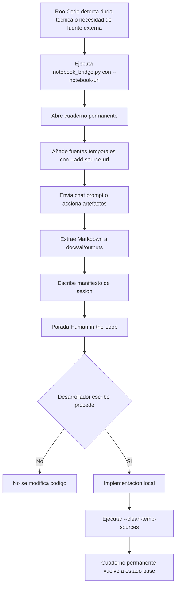

# 00 - Orquestación Arquitectónica IA: Roo Code <-> NotebookLM

## Estado del documento

- **Estado:** V3 implementada para cuaderno permanente, fuentes temporales y limpieza controlada. Documentación actualizada con Fase 5.5.
- **Última actualización:** 2026-07-04.
- **Ubicación sincronizable:** `docs/ai/00_orquestacion_arquitectura_ia.md`.
- **Módulo operativo:** [`tools-ai/`](../tools-ai/README.md:1).

## 1. Decisión estratégica

Crear el módulo interno `tools-ai/` para orquestar una interconexión bidireccional entre Roo Code y Google NotebookLM mediante Chrome DevTools Protocol (CDP), usando Playwright para controlar un perfil aislado de Chrome en `localhost:9222`.

El objetivo no es automatizar una subida manual de archivos. El objetivo real es convertir NotebookLM en un motor activo de síntesis de contexto, razonamiento de mercado y generación de artefactos profundos para Kavana Manufacturing: guías de estudio, tarjetas didácticas, cuestionarios de seguridad, resúmenes ejecutivos y guías de audio personalizadas. Roo Code actuará como piloto local que prepara el contexto, ejecuta interacciones controladas y extrae el conocimiento generado de vuelta al repositorio.

## 2. Propósito del módulo `tools-ai/`

`tools-ai/` es una herramienta interna de ingeniería, no código de producción. No toca backend, frontend ni database. Su función V3 es:

1. Lanzar un Chrome dedicado con depuración CDP en `localhost:9222`.
2. Mantener una sesión de Google separada en `tools-ai/notebooklm/chrome_profile/`.
3. Reutilizar el cuaderno permanente de Kavana Manufacturing: `https://notebooklm.google.com/notebook/a8ef67a8-896b-463e-a522-eaae826b3b79`.
4. Añadir fuentes externas temporales mediante `--add-source-url`.
5. Usar Fast Research por defecto mediante `--research-mode fast`; Deep Research solo con `--research-mode deep`.
6. Interactuar con chat o artefactos como Flashcards, Quizzes y Audio Overview.
7. Inyectar instrucciones específicas de personalización, por ejemplo: multi-tenancy, RLS, HMI offline-first y seguridad industrial.
7. Extraer el texto visible generado por NotebookLM a `docs/ai/outputs/` en Markdown con marca de tiempo.
8. Registrar un manifiesto de sesión en `docs/ai/outputs/notebooklm_session_latest.json`.
9. Limpiar fuentes temporales con `--clean-temp-sources` tras aprobación e implementación local.

## 3. Flujo V3



## 4. Por qué acelera Kavana Manufacturing

Esta automatización multiplica la capacidad de decisión fundacional porque reduce el ciclo entre:

- contexto técnico local,
- investigación externa controlada,
- síntesis estratégica en NotebookLM,
- artefactos de aprendizaje y comunicación,
- documentación auditable en el repositorio.

En lugar de que Roo Code solo lea y escriba archivos locales, NotebookLM se convierte en un co-piloto de análisis contextual. Roo Code puede pedirle que razone sobre arquitectura, mercado, seguridad, UX industrial y roadmap, y luego traer el resultado al repositorio para revisión humana.

## 5. Riesgos evaluados y controles

### 5.1 Robustez de selectores

**Riesgo:** Google puede cambiar clases CSS internas, hashes o estructura DOM de NotebookLM.

**Control:** El puente usa selectores semánticos de Playwright:

- `page.get_by_text(...)`
- `page.get_by_role(...)`
- placeholders y botones por nombre visible.

Se evita depender de clases CSS generadas automáticamente. Si una acción no encuentra un selector, el script registra una advertencia y continúa o deja el estado en el manifiesto.

### 5.1.1 Limpieza tolerante a fallos

**Riesgo:** NotebookLM puede cambiar el DOM del panel de fuentes, ocultar botones flotantes o requerir scroll antes de mostrar el menú de tres puntos.

**Control:** `--clean-temp-sources` no debe romper el flujo si una fuente no se puede eliminar automáticamente. El script registra el estado por URL y deja el manifiesto como `manual_cleanup_required` cuando la limpieza no puede confirmarse visualmente. Esto evita falsos positivos y obliga a revisar manualmente cualquier fuente temporal pendiente.

### 5.2 Aislamiento del perfil de Chrome

**Riesgo:** Usar el Chrome diario puede cerrar pestañas del usuario, mezclar sesiones o alterar preferencias personales.

**Control:** El lanzador crea y usa un directorio de perfil dedicado:

```text
tools-ai/notebooklm/chrome_profile
```

La sesión de Google queda guardada localmente en ese perfil tras el primer login manual, sin interferir con el navegador cotidiano.

### 5.3 Localhost estricto

**Riesgo:** Exponer CDP en red local podría permitir control remoto del navegador.

**Control:** El lanzador fija:

```text
--remote-debugging-address=127.0.0.1
--remote-debugging-port=9222
```

El puente solo se conecta a `http://localhost:9222`. No se expone el puerto fuera de la máquina local.

### 5.4 Seguridad de datos y trazabilidad

**Riesgo:** NotebookLM puede contener documentación sensible de arquitectura, seguridad o negocio.

**Control:** Todo el flujo es local salvo la interacción necesaria con Google NotebookLM. Las salidas se guardan bajo `docs/ai/outputs/`, con marca de tiempo, para revisión humana antes de usarlas como fuente de verdad. Las fuentes temporales se registran en un manifiesto y se limpian solo tras aprobación.

### 5.5 Human-in-the-Loop

**Riesgo:** Roo Code podría usar una síntesis de NotebookLM para modificar código sin validación humana.

**Control:** El script escribe `requires_confirmation_before_code_changes: true` en el Markdown y en el manifiesto. Roo Code debe presentar el plan y esperar un comando explícito del desarrollador, por ejemplo `procede`, antes de modificar código fuente.

## 6. Relación con los principios de Kavana Manufacturing

La automatización respeta los principios no negociables de Kavana Manufacturing:

- **Modularidad:** `tools-ai/` vive fuera de backend, frontend y database.
- **Trazabilidad:** la decisión queda registrada en `docs/ai/` y cada ejecución genera manifiesto.
- **Seguridad:** perfil aislado, localhost estricto, fuentes temporales controladas y revisión humana de salidas.
- **Offline-first:** las extracciones quedan en disco local para consulta posterior.
- **Industrial UI/UX:** NotebookLM se usa para generar cuestionarios y guías sobre HMI de 64px, baja carga cognitiva y visión de túnel.
- **Multi-tenancy:** los prompts de audio y artefactos priorizan RLS, `tenant_id`, PgBouncer y aislamiento de datos.

## 7. Primer uso esperado

1. Instalar dependencias Python.
2. Ejecutar `tools-ai/notebooklm/run_browser.bat`.
3. Iniciar sesión manualmente una vez en Google dentro del perfil aislado.
4. Confirmar que el cuaderno permanente está disponible en `https://notebooklm.google.com/notebook/a8ef67a8-896b-463e-a522-eaae826b3b79`.
5. Ejecutar el puente; `--notebook-url` ya apunta por defecto a ese cuaderno.
6. Revisar el Markdown generado en `docs/ai/outputs/`.
7. Revisar el manifiesto en `docs/ai/outputs/notebooklm_session_latest.json`.
8. Esperar confirmación explícita antes de modificar código.
9. Tras implementar y validar, ejecutar `--clean-temp-sources`.

## 8. Casos de uso principales

- Síntesis estratégica de decisiones de arquitectura o producto.
- Investigación externa controlada sobre PgBouncer, RLS, seguridad industrial o UX HMI.
- Generación de cuestionarios de seguridad sobre multi-tenancy, RLS, `tenant_id`, PgBouncer y HMI offline-first.
- Creación de guías de audio personalizadas para founders, ventas o equipo técnico.
- Preparación de reuniones con resúmenes ejecutivos y riesgos.
- Extracción local de artefactos de NotebookLM para revisión humana antes de convertirlos en documentación oficial.
- Limpieza de fuentes temporales para evitar degradación de contexto y respetar el límite de fuentes de NotebookLM.

## 9. Criterios de aceptación

- Existe `tools-ai/notebooklm/run_browser.bat`.
- Existe `tools-ai/notebooklm/notebook_bridge.py`.
- Existe `tools-ai/notebooklm/requirements.txt`.
- Existe `tools-ai/README.md`.
- Las salidas se guardan en `docs/ai/outputs/`.
- El script reutiliza cuadernos permanentes mediante `--notebook-url`.
- El script puede añadir fuentes externas temporales mediante `--add-source-url`.
- El script puede limpiar fuentes temporales mediante `--clean-temp-sources`.
- El script no modifica producción.
- El documento está en una ruta sincronizable con Google Drive para que NotebookLM pueda leerlo como contexto.
- NotebookLM no se considera fuente de verdad hasta revisión humana.
