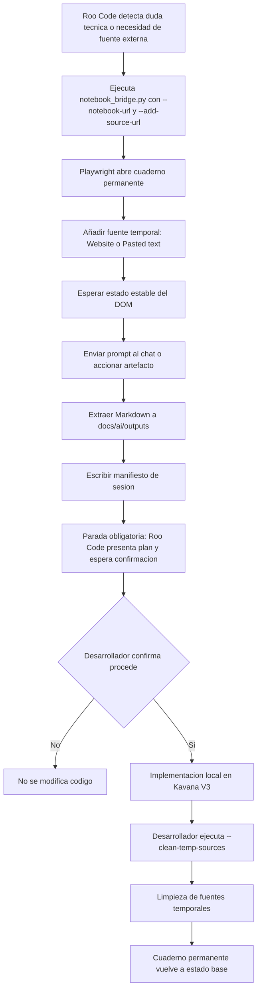

# Plan V3: NotebookLM Bridge con cuaderno permanente, ingesta externa y limpieza

## Estado del documento

- **Última actualización:** 2026-07-04. Documentación actualizada con Fase 5.5.

## Objetivo

Actualizar [`tools-ai/notebooklm/notebook_bridge.py`](tools-ai/notebooklm/notebook_bridge.py:1) para que Roo Code reuse un cuaderno permanente de NotebookLM, pueda añadir fuentes externas temporales por URL, extraer resultados a Markdown y limpiar esas fuentes temporales solo cuando el desarrollador lo apruebe.

## Estado actual

La implementación actual ya tiene:

- CDP local en `localhost:9222`.
- Perfil aislado de Chrome.
- `--notebook-url` y `--notebook-title`.
- Extracción de texto visible a `docs/ai/outputs/`.
- Selectores semánticos con Playwright.

Brechas V3:

- No existe ingesta nativa de fuentes externas mediante `--add-source-url`.
- No existe flujo de limpieza `--clean-temp-sources`.
- No existe manifiesto de sesión para saber qué fuentes temporales eliminar.
- No existe salida explícita de Human-in-the-Loop para detener Roo Code antes de modificar código.
- La documentación todavía puede contener referencias antiguas a caché local como salida por defecto.
- La limpieza necesita ser tolerante a fallos y registrar `manual_cleanup_required` si Google cambia el DOM o no permite confirmar la eliminación.
- El modo `pasted` debe usar pulsaciones reales y eventos de input para activar controles de Google.

## Flujo V3 propuesto



## Cambios de CLI

Añadir o ajustar:

- `--notebook-url`: obligatorio en modo V3. Si falta, usar `--notebook-title` como fallback con advertencia.
- `--notebook-title`: fallback para buscar el cuaderno si no se pasa URL.
- `--add-source-url URL`: argumento repetible para añadir fuentes externas temporales.
- `--source-mode`: `website` por defecto, alternativa `pasted`.
- `--chat-prompt`: prompt genérico para interactuar con el chat de NotebookLM.
- `--artifact`: acción a ejecutar. Valores propuestos: `chat`, `flashcards`, `quiz`, `audio`, `all`.
- `--audio-prompt`: mantener compatibilidad con la versión anterior.
- `--clean-temp-sources`: activa limpieza de fuentes temporales.
- `--cleanup-urls URL`: argumento repetible para limpiar URLs concretas. Si no se pasa, usar manifiesto de la última sesión.
- `--session-file`: ruta del manifiesto de sesión; por defecto `docs/ai/outputs/notebooklm_session_latest.json`.
- `--output-dir`: mantener compatibilidad.

## Diseño de funciones

### 1. Apertura de cuaderno permanente

Función: `open_permanent_notebook(page, args)`

Comportamiento:

1. Si `--notebook-url` existe, navegar directamente.
2. Si no, ir a NotebookLM y buscar por `--notebook-title`.
3. No crear cuadernos.
4. No subir archivos locales.
5. Esperar estado estable del DOM.

### 2. Ingesta de fuente externa

Función: `add_external_source(page, url, mode, timeout_ms)`

Secuencia resiliente:

1. Validar que la URL sea `http` o `https`.
2. Buscar botón semántico: `Add source`, `Añadir fuente`, `Source`, `Fuentes`.
3. Buscar opción: `Website`, `Web link`, `Enlace web`, `Link`, `Enlace`.
4. Si `mode=pasted`, buscar alternativa `Pasted text`, `Texto copiado`, `Paste text`.
5. Pegar URL o texto.
6. Si `mode=pasted`, usar pulsaciones reales y eventos de input para activar controles de Google.
7. Confirmar con Enter o botón visible.
8. Esperar a que desaparezcan indicadores de carga mediante texto visible y selectores de progreso.

Fallback: si no encuentra el flujo exacto, registrar advertencia y continuar sin añadir la fuente, para no bloquear la extracción.

### 3. Interacción con chat o artefactos

Función: `run_requested_artifacts(page, args)`

Valores:

- `chat`: localizar chat/composer, pegar `--chat-prompt`, enviar.
- `flashcards`: mantener flujo semántico actual.
- `quiz`: mantener flujo semántico actual.
- `audio`: mantener personalización de audio.
- `all`: ejecutar chat si existe prompt, luego flashcards, quiz y audio.

### 4. Extracción con contexto

Función: `extract_markdown(page, notebook_name, output_dir, session_state)`

Mantener formato actual:

```text
YYYY-MM-DD_HH-MM-SS_nombre.md
```

Añadir front matter:

- `generated_at`
- `notebook_url`
- `temporary_sources`
- `artifact`
- `human_in_the_loop: true`
- `requires_confirmation_before_code_changes: true`

### 5. Manifiesto de sesión

Archivo por defecto:

```text
docs/ai/outputs/notebooklm_session_latest.json
```

Contenido:

- `notebook_url`
- `notebook_title`
- `temporary_sources`
- `output_path`
- `created_at`
- `requires_confirmation_before_code_changes`
- `confirmation_status: pending`

Roo Code debe leer este manifiesto y detenerse hasta que el usuario escriba explícitamente `procede`.

### 6. Limpieza de fuentes temporales

Función: `clean_temporary_sources(page, args)`

Flujo:

1. Abrir cuaderno permanente.
2. Ir a sección `Sources`, `Fuentes` o panel lateral.
3. Para cada URL temporal:
   - Hacer scroll hasta la fuente si es necesario.
   - Buscar texto visible de la URL, dominio o nombre de ruta.
   - Localizar menú contextual de tres puntos o botón eliminar cercano.
   - Hacer clic en `Remove`, `Delete`, `Eliminar`, `Quitar`.
   - Confirmar diálogo si aparece.
   - Esperar que el texto ya no esté visible.
4. Registrar fuentes eliminadas y fallos.
5. Si una URL no se puede confirmar visualmente, dejar `confirmation_status: manual_cleanup_required`.
6. Solo marcar `confirmation_status: cleaned` cuando todas las URLs registradas se eliminaron o no existían.

Si no se pasan `--cleanup-urls`, usar `notebooklm_session_latest.json`.

## Regla Human-in-the-Loop

El script no modifica código fuente. Aun así, el flujo de orquestación debe quedar explícito:

1. Roo Code ejecuta NotebookLM con fuente externa.
2. NotebookLM genera Markdown local.
3. Roo Code presenta resumen del plan.
4. Roo Code se detiene.
5. Solo si el usuario escribe `procede`, se permite modificar código.

Esto debe documentarse en README y en la decisión arquitectónica.

## Riesgos y mitigaciones

| Riesgo | Mitigación |
|---|---|
| NotebookLM cambia selectores | Usar `get_by_role`, `get_by_text`, placeholders y fallbacks. |
| La fuente externa no se añade | Registrar advertencia, continuar y guardar estado en manifiesto. |
| Limpieza elimina fuente permanente | Limpiar solo URLs listadas en `temporary_sources` o `--cleanup-urls`. |
| Acumulación de fuentes | Manifiesto y `--clean-temp-sources`. |
| Roo Code modifica código sin aprobación | Salida explícita `requires_confirmation_before_code_changes: true` y regla operacional. |

## Criterios de aceptación

- `--notebook-url` abre directamente el cuaderno permanente.
- `--add-source-url` puede repetirse y añade fuentes externas temporales.
- `--chat-prompt` permite interactuar con el chat.
- La extracción conserva nombres `YYYY-MM-DD_HH-MM-SS_nombre.md`.
- Se genera manifiesto de sesión en `docs/ai/outputs/`.
- `--clean-temp-sources` elimina solo fuentes temporales registradas.
- La limpieza tolera fallos y deja `manual_cleanup_required` cuando no puede confirmar una eliminación.
- README documenta el flujo Human-in-the-Loop.
- `docs/ai/00_orquestacion_arquitectura_ia.md` queda actualizado.
- `py -3 -m py_compile tools-ai\notebooklm\notebook_bridge.py` pasa.

## Implementación en Code mode

1. Refactorizar argumentos CLI.
2. Añadir helpers de validación de URL y manifiesto.
3. Implementar apertura directa de cuaderno permanente.
4. Implementar ingesta de fuentes externas.
5. Implementar chat prompt y selector de artefactos.
6. Mejorar extracción Markdown con front matter ampliado.
7. Implementar limpieza de fuentes temporales.
8. Actualizar README y documentación estratégica.
9. Ejecutar `py_compile`.
